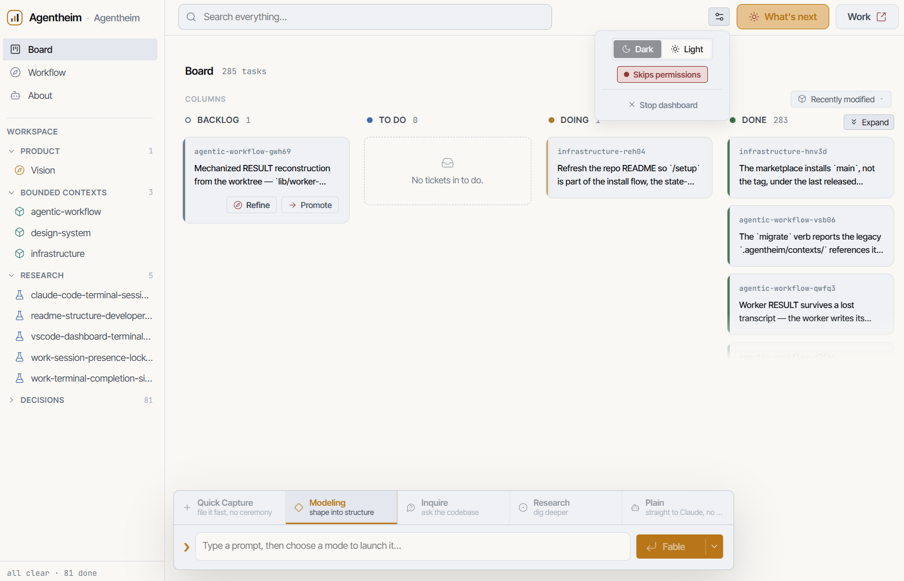

<div align="center">

# agentheim

**A DDD-flavored agentic harness for Claude Code — turn a raw idea into a modeled backlog of bounded contexts, then into parallel, dependency-aware execution.**

[](LICENSE)
[](https://github.com/heimeshoff/agentheim/tags)

<picture>
  <source media="(prefers-color-scheme: dark)" srcset="docs/dashboard-dark.png">
  <source media="(prefers-color-scheme: light)" srcset="docs/dashboard-light.png">
  
</picture>

</div>

Installed as a plugin once, used across projects. Agentheim turns a raw idea into a vision, a vision into a modeled backlog of bounded contexts, and a backlog into parallel, dependency-aware execution — with ADRs, a protocol log, and per-BC READMEs falling out naturally.

## Install

From inside Claude Code, in the project where you want the plugin:

```
/plugin marketplace add heimeshoff/agentheim
/plugin install agentheim@agentheim
/reload-plugins
/setup
```

The first command registers this repo as a marketplace — Claude Code clones it from GitHub for you, so no local download is needed (the `owner/repo` shorthand resolves to GitHub; the full `https://github.com/heimeshoff/agentheim` URL works too). The second installs the plugin from that marketplace. The third reloads skills and hooks so the plugin is live in the current session. Plugin commands are namespaced by plugin name (e.g. `/agentheim:modeling`).

The fourth, `/setup`, is a **one-time-per-machine** step (not per-project) that installs the zero-token `agentheim-dashboard` CLI and, optionally, the VS Code bridge — see the Dashboard section below. It's re-runnable at any time and is the upgrade path: run it again whenever the plugin updates or a version-skew banner tells you to.

<details>
<summary><b>Keeping the plugin up to date (consumer side)</b></summary>

Local/third-party marketplaces have auto-update **disabled** by default. To enable it, run `/plugin`, go to the **Marketplaces** tab, select `agentheim`, and choose "Enable auto-update". Claude Code will then refresh on startup and prompt you to run `/reload-plugins` when there's a new version.

To update manually:

```
/plugin marketplace update agentheim
/plugin update agentheim@agentheim
/reload-plugins
```

The first command refreshes the marketplace's view of the source repo, the second pulls the new plugin version into your project, and the third reloads skills/hooks so the change is live in the current session.

> **Maintainers:** cutting a release (version bump, tag, GitHub release notes) is documented in [RELEASE.md](RELEASE.md).

</details>

## How it works

Agentheim is an opinionated, human-in-the-loop loop: you think out loud, the harness captures and models, and only then does it write code. The full workflow — how brainstorm, modeling, research, and work hand off to each other, the architecture-foundation pass, the orchestration layer, the task lifecycle, and the knowledge layer — is laid out in a visual guide:

- **[agentheim-workflow.pdf](agentheim-workflow.pdf)** — renders inline on GitHub, one topic per page.
- **[agentheim-workflow.html](agentheim-workflow.html)** — the same guide as an interactive page; clone the repo and open it in a browser.

The work itself flows through **seven skills** (below). They auto-trigger from natural-language phrasing — no slash commands to memorize (the two deliberate exceptions are `/setup`, the one-time installer, and `/dashboard`, now a pointer to the installed CLI). Under the hood an orchestrator agent routes work to specialists (strategic-modeler, tactical-modeler, architect, researcher, worker). Two of those specialists are paired with a fresh-context **gate** that re-checks their output before it's trusted: the `verifier` audits a worker's code, and the `research-reviewer` re-verifies a researcher's factual claims against primary sources.

## The skills

| Skill | Triggered by | Produces |
|---|---|---|
| **brainstorm** | "let's brainstorm", "start a new project", "create a vision", "model this from scratch" | `.agentheim/knowledge/vision.md` (+ `context-map.md` when warranted). Closes with an architecture foundation pass that emits `type: decision` tasks, a walking-skeleton spike, and (when frontend exists) a styleguide task. No code yet — those land in `todo/` for `work` to execute. |
| **quick-capture** | "capture this", "jot this down", "just file it", "dump this in the backlog", "brain-dump", rapid-fire multi-idea lists | One raw `backlog/` task per idea, routed to the best-fit bounded context — **no questions, no refinement, no conversation.** The fast sibling of `modeling` for when you want to offload a thought and keep moving; captured tasks always get a later `modeling` refine pass before a worker sees them. Never writes to `todo/`. |
| **modeling** | "I have an idea", "let's model this", "refine the auth backlog", "promote X to todo", "there's a bug" | Task markdown files in `board/<bc>/backlog\|todo/` with status, dependencies, acceptance criteria. The conversational counterpart to `quick-capture`: a bare invocation first shows the backlog and offers to refine before capturing. |
| **work** | "start working", "execute the todo", "let's go", "pick up where you left off" | Code, commits, ADRs. Parallel workers respect the dependency DAG. Each worker runs TDD (red-green-refactor) by default, and every `SUCCESS` passes through a fresh-context **verifier** agent before the commit. |
| **research** | "research X", "state of the art for", "compare options for" | A markdown report in `.agentheim/knowledge/research/`. Every report passes through a fresh-context **research-reviewer** agent that re-verifies its checkable claims (versions, prices, package names, API surface) against primary sources before the report is citable. Cited by tasks and ADRs. |
| **inquire** | "how does X work", "where does Y live", "what was decided and why", "is X built yet" | A plain-prose answer grounded in the project's own structure (index, BC READMEs, ADRs, task boards), confirmed against the actual source. Read-only. |
| **whats-next** | "what's next", "what should I do now", "I'm done — now what" | The single most sensible next step (or two, when the project genuinely forks), read from the vision, every BC's task board, the recent protocol, and open questions. Read-only. |

**`quick-capture` vs. `modeling`** — both create backlog tasks, so disambiguate by intent. Reach for `quick-capture` when you're dumping a thought and moving on (terse one-liners, "just", "for later", an explicit BC, multi-idea lists); reach for `modeling` when you want to *work* the idea — explore it, refine acceptance criteria, talk it through. When it's genuinely ambiguous, `quick-capture` is the cheaper mistake: a too-thin task gets refined later, a too-heavy conversation can't be undone.

## Dashboard

A local, **read-only** web UI over the project's `.agentheim/` folder: a flat Kanban board pooling every BC's tasks across the four lifecycle columns, a universal slide-over that renders any artifact (tasks, BC READMEs, the vision, the context map, ADRs, research) as markdown, and live updates as skills move files on disk. It never writes to the project: the board carries no drag-to-promote or any other write-back — it is a total projection of disk ([ADR-0017](.agentheim/knowledge/decisions/0017-dashboard-read-only-skills-own-lifecycle.md)), and skills alone own the task lifecycle. Its action buttons (Refine, Promote, and the backlog launchers) don't mutate anything directly; they fire a seeded Claude session into a real terminal via the VS Code bridge ([ADR-0018](.agentheim/knowledge/decisions/0018-vscode-dashboard-terminal-bridge.md)) — e.g. Promote seeds `/agentheim:modeling promote <id>` — and degrade to copying that command to the clipboard when the bridge is absent.

Launching it costs no model turn once `/setup` (see Install above) has installed `agentheim-dashboard` into `<home>/.local/bin` ([ADR-0079](.agentheim/knowledge/decisions/0079-dashboard-cli-ships-via-setup-command.md)) — use it directly from any terminal, forever after, for zero tokens:

| Command | Does |
|---|---|
| `agentheim-dashboard` | Launch (or reuse) the detached server and auto-open the browser at `http://127.0.0.1:<port>/` |
| `agentheim-dashboard stop` | Stop the server and remove the runfile |
| `agentheim-dashboard status` | Report whether it's running, and on which port (read-only) |

`/dashboard` itself is now a **pointer**, not a launcher — it prints the two commands above and nothing else, so it never re-pays the ~120k-token cost of a slash-command launch. The CLI is a thin trigger over the one cross-platform launcher `dashboard/launch.mjs`; the server is Node-stdlib only — no framework, no `node_modules` install step, running on the Node that Claude Code already provides. See [`dashboard/README.md`](dashboard/README.md) for the runtime, endpoints, and verification status.

<details>
<summary><b>Optional: VS Code bridge — launch buttons that open a real terminal</b></summary>

The backlog column's **Quick Capture** and **Modeling** buttons start a seeded Claude session directly (`claude "/agentheim:quick-capture"` / `claude "/agentheim:modeling"`) instead of just copying the command. Because the dashboard runs inside VS Code's sandboxed Simple Browser, the only way to reach a real, visible terminal is a tiny local **VS Code bridge extension** — a `127.0.0.1`-only listener the dashboard talks to (see [ADR-0018](.agentheim/knowledge/decisions/0018-vscode-dashboard-terminal-bridge.md)). Without it, the buttons **silently fall back to copying the command to the clipboard** — that's a normal mode, not an error, so installing the bridge is optional.

**Three-way selection (`/setup use bridge <kind>`).** This VS Code extension is only one of three choices: `vscode` (this section, the default), `herdr` (mediated through a locally running [Herdr](https://herdr.dev) session — the dashboard's own server process drives the `herdr` CLI on your behalf, so no browser-reachable listener or extension install is needed at all), or `none` (skip bridge discovery entirely). Whichever kind is selected, the **clipboard fallback is always the floor**: every launch button silently copies its seeded command instead of opening a terminal whenever the chosen bridge is unreachable (see [ADR-0082](.agentheim/knowledge/decisions/0082-herdr-bridge-kind-and-mediated-launch-category.md)).

**Install it via `/setup`** — the primary install path. The same one-time, per-machine installer that ships the dashboard CLI ([ADR-0079](.agentheim/knowledge/decisions/0079-dashboard-cli-ships-via-setup-command.md)) also installs (or upgrades in place) the bridge from the `.vsix` already shipped with the plugin — choose the bridge option and there is no packaging step to run yourself.

**From-source alternative** — only needed if you're developing the extension itself (it isn't on the Marketplace, so this is how the shipped `.vsix` gets built in the first place):

```sh
cd vscode-extension
npm install                                    # fetches @vscode/vsce (packaging only — the runtime is stdlib)
npx vsce package --allow-missing-repository    # → agentheim-bridge-<version>.vsix
code --install-extension agentheim-bridge-*.vsix --force
```

The version in the filename tracks `vscode-extension/package.json` — always install the `.vsix` you just built rather than a version pinned in these docs. `--force` makes the command an **upgrade** as well as a first install; without it, `code` refuses to replace an already-installed build.

Then **activate** it:

1. Open the Agentheim project (any folder containing `.agentheim/`) as a workspace folder in VS Code.
2. Reload the window — `Ctrl/Cmd+Shift+P` → **Developer: Reload Window**. On startup the extension walks up to find `.agentheim/`, binds `127.0.0.1:31425` (falling back to `31426`/`31427`), and writes the discovery file `.agentheim/.dashboard/bridge.json`.
3. Click **Quick Capture** or **Modeling** — a `Claude` terminal opens and runs the seeded command. No dashboard refresh is needed; each click re-probes the bridge, and it works from an external browser too (the bridge echoes your origin in the CORS preflight; both ends are loopback).

**Upgrading (and the "older version" banner).** VS Code runs the *installed* extension, never the source in this repo — editing `vscode-extension/src/` (or re-running `/setup` without reloading) changes nothing until the window reloads. If the dashboard shows *"Your VS Code bridge is running an older version. Some launch options are unavailable. Run `/setup` to upgrade it, then reload the window."*, run `/setup` (or the from-source sequence above), **then** reload the window — a reload alone re-activates the same stale build and the banner will persist.

The terminal keeps Claude's **normal permission prompts intact** — the bridge never hard-wires `--dangerously-skip-permissions`. Trust boundary is loopback-only binding plus a per-activation shared-secret token, fine for a single-user dev box but not for any networked deployment. Uninstall via `/setup` (remove the bridge option), or manually with `code --uninstall-extension agentheim.agentheim-bridge` (it removes `bridge.json` on deactivation). See [`vscode-extension/README.md`](vscode-extension/README.md) for the full HTTP contract and architecture.

</details>

## Project state layout

All state for a project lives in `.agentheim/` inside that project — never in the plugin dir — split into two roots, one for durable knowledge and one for the operational task system ([ADR-0078](.agentheim/knowledge/decisions/0078-two-root-layout-knowledge-and-board-retiring-contexts-with-on-upgrade-migration.md)):

```
.agentheim/
├── knowledge/
│   ├── vision.md
│   ├── context-map.md                  # only for multi-BC domains
│   ├── index.md                        # top-level catalog (BCs, global ADRs, cross-BC research)
│   ├── decisions/                      # ADRs (global + BC-scoped)
│   ├── research/                       # research reports
│   └── contexts/
│       └── <bounded-context>/
│           ├── README.md               # ubiquitous language, aggregates, events
│           ├── INDEX.md                # knowledge-half catalog (ADRs, research, concepts)
│           └── concepts/               # opt-in synthesis pages (rich-domain BCs)
└── board/
    ├── protocol.md                     # chronological diary, newest on top
    ├── protocol/YYYY-MM.md             # rolled monthly archives
    └── <bounded-context>/
        ├── INDEX.md                    # task-half catalog (counts + backlog/todo/doing/done)
        ├── backlog/                    # captured, not yet refined
        ├── todo/                       # ready to work
        ├── doing/                      # in flight (claimed by a worker)
        ├── done/                       # completed, linked to commit SHA
        └── done-archive/               # rolled monthly done-list archive
```

A project created before September 2026 still has the old single-root shape; every writing skill (`brainstorm`, `quick-capture`, `modeling`, `work`, `research`) runs a `migrate` step before its own reads, so it moves to the layout above automatically the first time you use one — nothing to do by hand.

Tasks are plain markdown with frontmatter (`id`, `status`, `depends_on`, `type`). One task = one commit, made by the work skill after the worker reports `SUCCESS` *and* the verifier returns `PASS`. Workers return a strict `RESULT/TASK_ID/SUMMARY/FILES_CHANGED/...` format to keep the orchestrator context lean across long batches.

Each BC's `knowledge/contexts/<bc>/INDEX.md` and `board/<bc>/INDEX.md`, plus the top-level `knowledge/index.md`, are the **memory layer**: skills consult them for prior-art lookup before capture, for dependency hints, and for surfacing concept candidates. They're kept incrementally in sync by the mechanized task-lifecycle CLI the skills call; `scripts/backfill-indexes.ps1` rebuilds them for pre-existing state.

Scaffolding is English; your own domain language can be in any language.

## Spoken notifications

Want Claude Code to speak its end-of-turn summaries and attention prompts aloud? That's a separate plugin: **utterheim-narrator**, which lives in the [Utterheim](https://github.com/heimeshoff/utterheim) repo (the local TTS sidecar) and is installed independently. See `utterheim/claude-code-plugin/README.md` for setup and the `/narrator` voice picker.

## Layout of this repo

```
.claude-plugin/plugin.json         # plugin manifest
agents/                            # orchestrator + specialists (incl. verifier, research-reviewer)
skills/                            # brainstorm, quick-capture, modeling, research, work, inquire, whats-next, + doctrine skills
commands/setup.md, commands/dashboard.md  # /setup (install), /dashboard (pointer) — the two process-launcher exceptions
lib/                               # mechanized task-lifecycle CLI, live-tree lints, plugin-file resolvers
dashboard/cli/                     # the CLI /setup installs verbatim into <home>/.local/bin
dashboard/                         # the local web-UI runtime (stdlib Node server + launcher + frontend app)
vscode-extension/                  # VS Code bridge source + the committed agentheim-bridge-<version>.vsix
scripts/backfill-indexes.ps1       # one-shot rebuild of .agentheim/ indexes for projects predating 0.6.0
evals/                             # benchmarks against other harnesses
references/                        # design notes and source material
```

## Since the last restructure (0.8.8 → 0.9.4)

- The `.agentheim/` two-root layout — `knowledge/` and `board/` — with a `migrate` step every writing skill runs automatically ([ADR-0078](.agentheim/knowledge/decisions/0078-two-root-layout-knowledge-and-board-retiring-contexts-with-on-upgrade-migration.md)).
- `/setup` installs the zero-token `agentheim-dashboard` CLI and, optionally, the VS Code bridge ([ADR-0079](.agentheim/knowledge/decisions/0079-dashboard-cli-ships-via-setup-command.md)).
- `/dashboard` is now a pointer, not a launcher ([ADR-0079](.agentheim/knowledge/decisions/0079-dashboard-cli-ships-via-setup-command.md)).
- `/agentheim:work <id>` runs a scoped batch of exactly the tasks you name, instead of the whole ready set ([ADR-0071](.agentheim/knowledge/decisions/0071-work-scoped-run-argument-grammar.md)).
- A worker's branch now carries only source and tests; the conductor materializes ADRs, README updates, and task moves on `main` at merge ([ADR-0074](.agentheim/knowledge/decisions/0074-worker-branch-source-and-tests-only-conductor-materializes-bookkeeping.md)).
- A worker's result survives a lost transcript via a sidecar file the conductor reads first ([ADR-0080](.agentheim/knowledge/decisions/0080-worker-result-redundancy-sidecar-trailing-header-and-conductor-source-ladder.md)).
- The marketplace now pins the release tag, so an install never lands on a mid-rollout snapshot of `main` ([ADR-0081](.agentheim/knowledge/decisions/0081-marketplace-pins-release-tag-not-main.md)).
- Acceptance criteria are split machine-checkable vs. human-eye, so a subjective criterion is a named eye-check instead of being silently proxied ([ADR-0061](.agentheim/knowledge/decisions/0061-falsifiability-gate-machine-vs-human-eye-criteria.md)).

See [CHANGELOG.md](CHANGELOG.md) for the full release history.

## Status

Currently **0.9.4**. Load-bearing disciplines — no-code brainstorm, strict worker return format, orchestrator never writing code, protocol log on every action — are intentional and should not be regressed.

## License

See [LICENSE](LICENSE).
